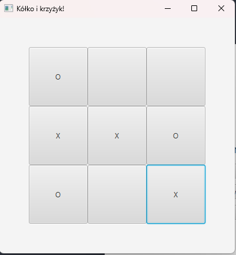

# TicTacToe with MiniMax algorithm

This is a simple TicTacToe game with a computer opponent that uses the minimax algorithm to make its moves.

It's written in Kotlin and uses JavaFX for the GUI.

Made for a university assignment and for practicing Kotlin.

## Gamemodes

There are two gamemodes:
- Regular

    Normal TicTacToe rules. The first player to get three in a row wins.

- Modified

    The first three moves are like normal. In the final move you select a field you already placed a mark on and move it to another place in the same row or column. If no one wins after the final move the game ends in a tie.

You have the option to go first or second.

## Screenshots

Main Menu

Order Choice

Game

Game Result

#
# Kółko i krzyżyk z algorytmem MiniMax

Prosta implementacja gry w kółko i krzyżyk z komputerowym przeciwnikiem, który używa algorytmu minimax do wyboru ruchów.

Napisana w Kotlinie i używająca JavaFX do GUI.

Zrobiona na zadanie z przedmiotu na uczelni i do ćwiczenia Kotlina.

## Tryby gry

Są dwa tryby gry:
- Zwykły

    Zasady zwykłego kółka i krzyżyk. Pierwszy gracz, który ułoży trzy znaki w rzędzie, wygrywa.

- Zmodyfikowany

    Pierwsze trzy ruchy są jak zwykle. W ostatnim ruchu wybierane jest pole, na którym jest własny znak i jest przenoszone na inne pole w tym samym rzędzie lub tej samej kolumnie. Jeśli po ostatnim ruchu nikt nie wygra, gra kończy się remisem.

Można wybrać kolejność ruchów.

## Zrzuty ekranu

Menu główne

Wybór kolejności

Gra

Wynik gry

